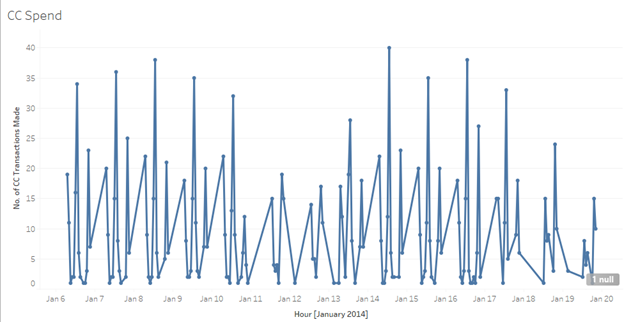

```{r setup, include=FALSE}
knitr::opts_chunk$set(echo = FALSE)
```

# Introduction

The goal of the annual Institute of Electrical and Electronics Engineers (IEEE) Visual Analytics Science and Technology (VAST) Challenge is to advance the field of visual analytics through competition. The 2021 IEEE VAST Challenge brings back a classic challenge from 2014 to see how approaches and techniques have developed since the original release of the challenge.  

The background of the challenge is as below:  

In the roughly twenty years that Tethys-based GAStech has been operating a natural gas production site in the island country of Kronos, it has produced remarkable profits and developed strong relationships with the government of Kronos. However, GAStech has not been as successful in demonstrating environmental stewardship.  

In January, 2014, the leaders of GAStech are celebrating their new-found fortune as a result of the initial public offering of their very successful company. In the midst of this celebration, several employees of GAStech go missing. An organization known as the Protectors of Kronos (POK) is suspected in the disappearance, but things may not be what they seem.  

# Objective 

The project aims to deliver an R-Shiny app that provides:
1. Interactive user interface design
2. Exploratory functions
3. Clustering techniques through both aspatial and geospatial methods


We will make use of R packages want to conceptualize a methodical approach of profiling individuals.  

We do this by exploring and doing the following: 

* Obtaining a more holistic profile of employees from all our datasets.
* Obtaining structured data, like how many coffees this person drink a day, etc * Identifying any anomalous or suspicious behavior.
* Identifying formal (work-related) or informal (non-work related e.g., playing golf together during the weekends) relationships.
* Understanding what the daily routines of the employees are like. 
  + Exploring if there is a difference between their weekday and weekend routines? Are their daily routines dependent on their employment type?
* Discover different ways of grouping/segmenting the employees.
*Are there any relationships between CC expenditure + GPS [MC2] and events we can extract from News articles [MC1]

# Scope and Methodology

Our scope and methodology is as below:  

1.	Analysis of VAST 21 data set with background research
2.	Exploratory Data Analysis (EDA) methods in R
3.	Exploratory Spatial Data Analysis (ESDA) methods in R
4.	Clustering methods for aspatial and geospatial information in R
5.	Network Analysis in R
6.	R Markdown development for functionality checks
7.	R-Shiny app development for user interactivity

# First look

* Map of Abila, Kronos
 
 
 * Trend of credit card transactions over time - The number of credit card transactions peak at 1pm and 8pm on a daily basis.


* Movement of Cars & Trucks - We see that there is no movement of trucks over the weekends.


